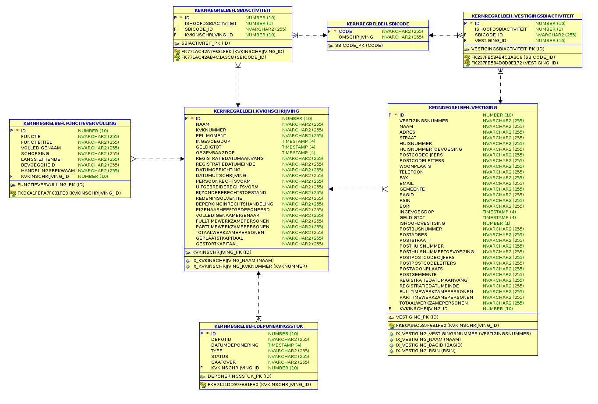

# Technische en functionele beschrijving CVnHR applicatie QNH

## Functionaliteit
De CVnHR (Centrale Voorziening nieuw Handels Register) realiseert een koppeling met de 
landelijke voorziening van het nieuw Handels Register (nHR). Deze landelijke voorziening 
wordt verzorgd door de Kamer van Koophandel (KvK). De applicatie voorziet in het ophalen 
en opslaan van gegevens uit de nHR en de aansluiting van overige applicaties die deze 
gegevens willen gebruiken.

## Technische componenten

De CVnHR applicatie bestaat uit 3 onderdelen

1.	Een webapplicatie voor beheer en raadpleging van de gegevens in de CVnHR applicatie, 
en het exporteren van de CVnHR applicatie gegevens naar een CRM applicatie.
2.	Een database voor opslag van de nHR gegevens.
3.	Een executable voor het in batch updaten van de CVnHR inschrijvingen en het in batch 
updaten van een CRM applicatie.

## Server configuratie
De CVnHR kan in principe op iedere server draaien die .NET4.6.1 ondersteunt. De meest voor 
de hand liggende configuratie is Windows Server 2008 of hoger, met de Webserver (IIS) rol 
geïnstalleerd. De volgende rollen zijn minimaal vereist bij het instellen van de Webserver 
(IIS) rol:

-	Web Server
    - Common http Features
        - Default Document
        - Directory Browsing
        - HTTP Errors
        - Static Content
        - HTTP Redirection
    - Health and diagnostics
        - HTTP Logging
        - Custom Logging
        - Logging Tools
    - Performance
        - Static Content Compression
    - Security
        - Request Filtering
        - Basic Authentication
        - Centralized SSL Certificate Support
        - Client Certificate Mapping Authentication
        - IIS Client Certificate Mapping Authentication
        - Windows Authentication
    - Application Development
        - .NET Extensibility 4.6
        - ASP.NET 4.6
        - CGI
        - ISAPI Extensions
        - ISAPI Filters
-	Management Tools
        - IIS Management Console

De volgende features zijn minimaal vereist bij het instellen van de Webserver (IIS) rol:

-	.NET Framework 4.6 Features
    - .NET Framework 4.6
    - ASP.NET 4.6
    - WCF Services
        - HTTP Activation
        - TCP Activation
        - TCP Port Sharing

### Overige server installatie vereisten
Voor een correcte werking van het genereren van PDF bestanden moet de volgende package 
geïnstalleerd zijn op de server:
-	Visual C++ Redistributable Packages for Visual Studio 2013 
    - Deze is te downloaden via de volgende url:
    - https://www.microsoft.com/en-us/download/details.aspx?id=40784
    - Kies voor de x86 versie
    - Als bovenstaande url niet meer werkt kan gezocht worden op “vcredist_x86 (2013)”

## Gebruikersgroepen en beveiliging
Voor het gebruikersbeheer in de applicatie moet minimaal 1 gebruiker ingesteld worden in de
configuratie (zie hoofdstuk configuratie) onder Config\AppSettings.config in de key 
"InitialUserAdministrators". Verder kan via de key "ADDistinguishedNameFilters" verder 
gefiltert worden op domein gebruikers. (Tip, bekijk vanaf de server de url /debug waarin de 
volledige AD naam getoond wordt.)

De initiele administrator ziet in het menu een pagina "Gebruikersbeheer". Hier kunnen verdere
gebruikers ingesteld worden.

Op dit moment werkt de applicatie alleen voor meedere gebruikers wanneer deze geïnstalleerd
staat op een netwerk met AD koppeling. Zonder AD kan de applicatie wel werken, de 
gebruikersnaam met rechten kan dan ingesteld worden via de key "UsernameToUseWhenEmpty".

## Webapplicatie
De webapplicatie voor het beheer en raadplegen van de gegevens in de CVnHR applicatie 
bevat de volgende functionaliteit:

### Raadplegen van de CVnHR applicatie 
Door middel van de raadpleegschermen zijn de reeds in de CVnHR applicatie geladen 
inschrijvingen te doorzoeken. Er kan op diverse eigenschapen van een inschrijving 
gezocht worden. De applicatie zal een lijst van inschrijvingen teruggeven. In een 
zoekopdracht werkt het procentteken (‘%’) als wildcard. Zo kan het zoeken op de term 
‘Jan%Boer’ zowel de resultaten ‘Jan Boer’, ‘Jan de Boer’, ‘Jan van de Boer’ als 
‘De heer Janboer’ opleveren. Naast het zoeken kan ook een lijst van alle inschrijvingen 
in de CVnHR database getoond worden. Vanuit het zoekresultaatscherm kan gekozen worden 
om de details in te zien  van een inschrijving, een inschrijving te verwijderen uit de 
CVnHR applicatie, of deze te exporteren naar een CRM applicatie. Wanneer gekozen wordt 
om details in te zien van een inschrijving, wordt er een lijst van vestigingen getoond 
die behoren bij de inschrijving. Hier kan per vestiging gekozen worden om deze door te 
zetten naar een aangesloten (CRM) applicatie, of door middel van het klikken op de knop 
“Alle vestigingen naar [applicatie]” door te zetten.

Per vestiging is het mogelijk detailgegevens voor de specifieke vestiging te zien door te 
klikken op de desbetreffende rij in de tabel. 

### Raadplegen van de KvK 
De webapplicatie biedt de mogelijkheid om rechtstreeks de KvK te bevragen. Dit kan door een 
KvK nummer op te geven. Om het vinden van een KvK nummer te vergemakkelijken is het mogelijk 
gemaakt door middel van het invullen van een (deel van) naam rechtstreeks op de website 
van de KvK het nummer te vinden. Wanneer er een match is kan er gekozen worden om de details 
in te zien of om de inschrijving te importeren. Dit laatste heeft als gevolg dat de gegevens 
in de CVnHR applicatie worden bijgewerkt. De schermen die getoond worden om de gegevens van 
de KvK inschrijving in te zien zijn identiek aan de schermen om de gegevens van de CVnHR 
applicatie in te zien. Om duidelijk te maken in welk gedeelte men zoekt is een logo 
toegevoegd links van het scherm. 

## Batchupdate van de CVnHR applicatie
Door middel van een batchupdate kunnen alle inschrijvingen in de CVnHR applicatie eenmalig 
of periodiek geüpdatet worden. De logica van de applicatie haalt voor ieder KvK nummer in 
de CVnHR applicatiedatabase de actuele gegevens op van het nHR en vergelijkt deze met de 
opgeslagen gegevens in de CVnHR applicatiedatabase. Wanneer deze gegevens niet overeen komen 
wordt een nieuw record aangemaakt in de CVnHR applicatiedatabase en worden de oude gegevens 
als niet meer geldig gemarkeerd. Na afronding van het actualiseren van alle gegevens wordt 
het aantal geüpdatete gegevens in een logfile weggeschreven. Ook is in dit logbestand 
zichtbaar of er onvoorziene fouten zijn opgetreden tijdens het uitvoeren van de batch. 

## Importeren van KvK inschrijvingen
Het is mogelijk om vanuit de webapplicatie een groot aantal inschrijvingen te importeren 
middels een CSV bestand. Dit bestand bevat een lijst van KvK inschrijvingsnummers. Deze 
lijst wordt doorlopen door de applicatie en importeert één voor één de inschrijvingen met 
bijbehorende vestigingen. Een voorbeeld van CSV bestand is te vinden op de importeerpagina. 
Deze functionaliteit is beschikbaar op dezelfde pagina als de batchupdate.

Na het klikken op de knop “Voeg bestanden toe…” wordt een upload scherm getoond waar de 
beheerder een CSV bestand kan kiezen waarin op iedere rij een KvK nummer staat. Na het 
kiezen van dit bestand is te zien welk bestand gekozen is. De bulkimport kan nu gestart 
worden door middel van het klikken op de knop “Start upload” of “Start”. Deze actie kan 
ook geannuleerd worden door middel van het klikken op de oranje knoppen “Cancel”  of 
“Annuleer upload”. Na het starten van de bulk import wordt een scherm zichtbaar waarin 
de voortgang van de upload zichtbaar is. Mochten er tijdens de upload fouten zijn opgetreden 
zijn deze terug te vinden in de logbestanden (zie hoofdstuk Logbestanden).

## Synchronisatie logica
Wanneer gegevens vanuit KvK in de CVnHR applicatie worden geïmporteerd, worden deze gegevens 
volgens onderstaand regels gesynchroniseerd. Onder de het hoofdstuk “Datamodel” wordt 
beschreven hoe de gegevens in de database worden opgeslagen. De inschrijvingen en 
vestigingen hebben een ingangsdatum en een geldigheidsdatum waardoor er historische 
data opgeslagen kan worden.

-	KvK gegevens zijn leidend
-	Wanneer een nieuwe inschrijving of vestiging wordt geïmporteerd, wordt deze aangemaakt 
in de database.
-	Wanneer een wijziging in inschrijving of vestiging wordt vastgesteld (een van de 
eigenschappen wijkt daarmee af) wordt een nieuw record toegevoegd met de bijgewerkte data, 
en wordt de “oude” afgesloten.
-	Wanneer een vestiging wel in de CVnHR applicatie maar niet bij KvK gevonden wordt, 
wordt de vestiging in de CVnHR applicatie afgesloten. 

## Exporteren van CVnHR applicatie gegevens naar een externe applicatie
Het is vanuit zowel een resultaatscherm als een detailscherm mogelijk een specifieke 
inschrijving te exporteren naar een externe applicatie. De logica voor het exporteren zal 
per gekoppelde applicatie verschillen. Dit zal ook apart gedocumenteerd worden. Hieronder 
staan wel enkele generieke mogelijkheden beschreven:

1.	De inschrijving bestond nog niet in de externe applicatie en is nieuw aangemaakt. 
De gebruiker wordt door middel van een link de mogelijkheid geboden de inschrijving 
automatisch aan te laten maken in de externe applicatie.
2.	De inschrijving bestaat reeds in de externe applicatie. De gegevens worden geüpdatet. 
3.	Er gaat iets fout. Meerdere redenen kunnen hiervoor de oorzaak zijn. Er wordt een scherm 
getoond aan de gebruiker met hierin informatie over de oorzaak van de fout.

Het is tevens mogelijk om door middel van een batchupdate alle externe applicatie vestigingen
te updaten met de meest recente gegevens uit de CVnHR applicatie.  Dit kan zowel eenmalig als
via een geplande, dagelijkse, wekelijkse of maandelijkse batchupdate. Na het afronden van een
batch worden de resultaten weggeschreven in een logbestand. Het scherm om deze functionaliteit
te beheren is te bereiken via de menuoptie “Naar [applicatie]” in het menu aan de bovenkant
van het scherm.

## Exporteer logica
Wanneer de gegevens vanuit de CVnHR applicatie worden geëxporteerd naar een externe 
applicatie worden deze gegevens volgens onderstaande logica geëxporteerd. 

-	De vestigingen in de externe applicatie zijn leidend
-	CVnHR applicatie gegevens zijn leidend
-	Wanneer een vestiging in de externe applicatie bestaat en gevonden kan worden op 
basis van een overeenkomstig KvK nummer en vestigingsnummer worden de relevante gegevens 
overschreven door de gegevens uit de CVnHR applicatie.
-	Wanneer een vestiging of gehele KvK inschrijving bestaat in de CVnHR applicatie maar 
niet in de externe applicatie gevonden kan worden wordt dit vermeld in een log bestand.
-	In het geval van de batchupdate worden alleen reeds in de externe applicatie bestaande 
vestigingen bijgewerkt.

Deze regels kunnen naar wens per applicatie verschillen op basis van de functionele wensen.

## Debugging
In de webapplicatie is een speciale sectie opgenomen waarop debug informatie getoond wordt. 
De volgende informatie wordt getoond:
- Een link naar de “elmah log”. Dit log bestand houdt alle in de webapplicatie opgetreden 
exceptions bij. Dit bestand is alleen vanaf de server waarop de applicatie geïnstalleerd 
staat bereikbaar.
- Een kort overzicht van het aantal inschrijvingen en vestigingen die niet meer geldig zijn 
in de database. De applicatie verwijderd geen gegevens uit de database, maar zet in plaats 
daarvan de geldigheid van de gegevens.
- Eventuele database inconsistenties. Door onvoorziene fouten in het opslagproces kunnen 
records ontstaan in de database die geen juiste relaties meer hebben. Dit heeft geen invloed 
op de werking van de applicatie of op de getoonde data. Deze records kunnen verwijderd 
worden.

Deze sectie is bereikbaar door aan de root url van de applicatie ‘/debug’ toe te voegen.

## Executable
De hiervoor beschreven batchupdate van de CVnHR applicatie en een externe applicatie worden 
uitgevoerd door een executable. Deze executable heeft een eigen configuratiebestand en houdt 
zijn eigen logbestanden bij. De executable staat los van de webapplicatie op de server en 
kan door de webapplicatie gestart worden. De webapplicatie installeert automatisch twee 
“Scheduled tasks” in de “Windows Task Scheduler” op de server, welke geconfigureerd kunnen 
worden in de batchupdate schermen. Tevens kunnen deze “Scheduled tasks” beheerd worden in de 
standaard beheerschermen voor “Windows Task Scheduler”. Één “Scheduled task” voert de 
batchupdate van de CVnHR applicatie uit, de andere de batchupdate van de externe applicatie.

## Logbestanden
Alle onvoorziene foutmeldingen worden door middel van een textbestand met de extentie “.log” 
bijgehouden op de server. Daarnaast wordt een textbestand bijgehouden met een samenvatting 
van de voor de gebruiker relevante events. Deze bestanden zijn te openen in een willekeurige 
tekstverwerker. Van de bestanden zijn maximaal de laatste 10 beschikbaar gemaakt in de 
webapplicatie bij de batchupdate schermen. Deze kunnen rechtstreeks in de webapplicatie 
bekeken worden. Voor het bekijken van de overige log bestanden is toegang tot de server 
benodigd. Voor de logging wordt nLog gebruikt [http://nlog-project.org/]. De logging is 
volledig in te stellen middels het nlog.config bestand in de root van de webapplicatie en 
in de root van de map waarin de executable staat. Voor uitgebreide documentatie over dit 
bestand zie: https://github.com/nlog/nlog/wiki/Configuration-file. 
(En/of  http://nlog-project.org/)

### Logbestand configuratie Website
Voor de website zijn 2 loggers opgenomen in de nlog.config met beide hun eigen functie. 
-	Een logger met de naam “*”. Deze logger schrijft alle applicatie trace/debug/informatie 
logging weg, en schrijft alle errors volledig uit.
-	Een logger met de naam “kvkerror”. Deze logger schrijft alle errors uit die de KvK 
service ervaart (bij aanroepen vanaf de beheer website) bij het opvragen en ontvangen van 
KvK gegevens. De log resulterend uit deze logger kan onder andere gebruikt worden voor 
terugmeldingen op de KvK.
- Een logger met de naam "kvkCountingLoggerFile". Deze log houdt alle kvk aanroepen bij.
- Een logger met de naam "apiLoggerFile". Deze log houdt alle aanroepen op de API (bijv. 
via de ESB) bij.
- Een logger met de naam "authorizationLoggerFile". Deze log houdt alle inlogacties van
gebruikers bij.

Bij de meeste logbestanden is het aan te raden op de productieomgeving de minLevel op “Error” 
in te stellen. Hiermee worden alleen de errors weggeschreven en groeien de logfiles niet 
al te groot.

### Logbestand configuratie Executable
Voor de executable zijn 3 loggers opgenomen in de nlog.config met elk hun eigen functie. 
-	Een logger met de naam “*”. Deze logger schrijft alle applicatie trace/debug/informatie 
logging weg, en schrijft alle errors volledig uit.
-	Een logger met de naam “functionalLoggerKernregistratie”. Deze logger schrijft het 
functionele logbestand uit dat in de beheerschermen te downloaden is bij de batchupdates van de CVnHR applicatie. 
    - Bij deze logger is het aan te raden de minLevel op “Debug” in te stellen. Hiermee wordt
    voor de beheerde relevante informatie uitgeschreven.
-	Een logger met de naam “functionalLoggerCrm”. Deze logger schrijft het functionele 
logbestand uit dat in de beheerschermen te downloaden is bij de batchupdates van de CRM 
omgeving.
    - Bij deze logger is het aan te raden de minLevel op “Debug” in te stellen. Hiermee 
    wordt voor de beheerde relevante informatie uitgeschreven.
    - Als bij deze logger de minLevel op “Trace” ingesteld wordt worden alle wijzigingen 
    per geüpdatet CRM record uitgeschreven in een bestand dat ingeladen kan worden in Excel. 
    Hiermee kunnen analyses uitgevoerd worden over de datakwaliteit van de gegevens uit 
    de KvK.

# Database

## Technisch datamodel
De gegevens worden in de database van de CVnHR applicatie opgeslagen volgens het onderstaande 
database diagram.
 

De verbinding met de database wordt tot stand gebracht met behulp van een nHibernate 
connectionstring. Deze is opgenomen in de configuratie bestanden van de zowel de 
webapplicatie als de executable.

# Installatie
De database kan automatisch door de webapplicatie aangemaakt worden door het instellen 
van de configuratie setting “CreateDatabase” in de appSettings (zie hoofdstuk “Het 
configureren van de executable en de webapplicatie”). Het is aangeraden deze setting 
voor acceptatie en productie omgevingen altijd op “false” te houden. De database kan ook 
handmatig aangemaakt worden. Bij het starten van de webapplicatie zal in de webroot in de 
map /App_Data/SQL een bestand aangemaakt worden “Generated-SQL.sql”. In dit bestand staat 
het script om de database handmatig aan te maken.

## Configuratie en Installatie
De installatie van de applicatie bestaat uit de volgende onderdelen:
1.	Het installeren van de certificaten
2.	Het installeren van de executable
3.	Het configureren van de executable
    a. Het configureren van de connectie naar de database
    b. Het configureren van de connectie naar overige applicatie(s)
4.	Het installeren van de webapplicatie
5.	Het configureren van de webapplicatie
    a. Het configureren van de connectie naar de database
    b. Het configureren van de connectie naar overige applicatie(s)
    c. Het configureren van de locatie van de executable

### Het installeren van de executable en de webapplicatie
Voor de installatie van de applicatie wordt een zipfile opgeleverd die alle benodigde 
bestanden van de applicatie bevat. De zipfile bestaat op hoofdniveau uit een map “CVnHR”. 
Deze map bevat een submap “Website” deze map bevat alle bestanden benodigd voor de 
webapplicatie. Daarnaast is er een submap "Batch" om de executable te installeren.

Met behulp van de Internet Information Services (IIS7) kan een webapplicatie aangemaakt 
worden op de folder waarin de webapplicatie staat. Het is aan te raden een aparte 
Application pool voor deze applicatie aan te maken zodat deze gescheiden is van eventuele 
andere applicaties die binnen IIS draaien. De applicatiepool moet draaien als “LocalSystem” 
user in verband met de toegang tot de certificaten om de connectie met de KvK te kunnen 
maken. Verder kan in IIS ingesteld worden onder “Authenticatie” op welke wijze de gebruiker 
voor de applicatie geauthentiseerd wordt. Bij organisaties die werken met het windows 
operating systeem zal hiervoor over het algemeen “windows authenticatie” worden ingesteld.

De executable is te installeren door het plaatsen van de submap "Batch" in dezelfde map als
de submap "Website". De website heeft een verwijzing naar het bestand 
"QNH.Overheid.KernRegister.BatchProcess.exe" nodig om deze in te kunnen stellen. Dit is in de
/Configs/AppSettings.config van de website in te stellen onder de key 
"BatchProcessExecutablePath"

### Het installeren van de certificaten
Voor de connectie naar de KvK service zijn vier certificaten benodigd. Deze certificaten 
vormen samen een ketting en zijn te installeren als één geheel. De gehele ketting is 
noodzakelijk en bestaat uit drie publiekelijk beschikbare certificaten (te downloaden 
via o.a. de site van de KvK) en een top-level PKI overheids certificaat. Dit certificaat 
is specifiek voor de organisatie en benodigd voor de aansluiting met de KvK. Dit certificaat 
kan per server verschillen. Uitgebreide informatie over de benodigde certificaten is 
te vinden in de documentatie van de KvK service. In het configuratie bestand van de 
webapplicatie (/config/system.serviceModel.behaviors.config) onder 
configuration/system.servicemodel/behaviors/endpointbehavior/ is in te stellen en/of te 
vinden welke certificaten benodigd zijn.

## Het configureren van de executable en de webapplicatie
Zowel de executable als de webapplicatie zijn te configureren door het aanpassen van de 
[web | app].config file in de root (hoofdmap) van de applicatie en/of de .config bestanden in
het submapje /config. Voor de benodigde bestanden wordt een voorbeeld bestand aangeleverd in
de submap /config/examples. In deze bestanden staat per in te stellen item een korte beschrijving
in de comments. Deze bestanden bevat per in te stellen item een korte beschrijving 
over wat deze instelling doet. De belangrijke secties/bestanden zijn: 

-	/config/ConnectionStrings.config
    - Hier worden de connecties naar de Database opgegeven
    - Deze configuratie voldoet aan de standaarden zoals door Microsoft opgesteld voor .NET 
connectionStrings.
-	/config/AppSettings
    - Hier worden de applicatie specifieke settings opgegeven waaronder de gegevens voor de 
applicatiegebruiker en de database schema naam.
-	/config/system.serviceModel.behaviors.config en /config/system.serviceModel.client.config
    - Hier wordt de connectie naar de KvK opgegeven
    - Voor uitgebreide beschrijving zie de documentatie van Microsoft WCF (Windows 
  Communication Foundation). De configuratie voldoet aan de standaarden zoals gesteld door 
  Microsoft.

Verder kan in IIS onder .NET Authorization Rules ingesteld worden welke AD gebruikers 
en/of groepen toegang hebben tot de webapplicatie. Zie voor uitgebreide documentatie 
hierover de documentatie van IIS.

## Proxy instellingen
In de de [web | app].config file in de root (hoofdmap) van de applicatie is onder de sectie
"system.net/defaultProxy" een proxy in te stellen. Voor specifieke instructies hoe dit in te
stellen wordt verwezen naar de documentatie van .NET en/of het uitgecommentarieerde voorbeeld
in de web.config van de website.

# Integratie

De webapplicatie integreert met externe services door middel van het SOAP protocol en/of via
de API door middel van het REST protocol. Hiervoor is de door Microsoft ontwikkelde techniek 
WCF gebruikt. Deze integraties zijn hierdoor volledig in configuratie (web.config) 
instelbaar (zie het vorige hoofdstuk). Hieronder staat voor de KvK service kort de 
gebruikte techniek opgesomd.

## KvK
-	Two way SSL verbinding, zowel bij het KvK als bij de server waar de CVnHR wordt 
geïnstalleerd moeten certificaten zijn ingesteld om deze verbinding tot stand te brengen.
-	SOAP Service, deze staat geïnstalleerd bij de KvK en is benaderbaar met een werkende 
internet verbinding.

## Gebruikte technologie
 
Hieronder staan de gebruikte technologieën benodigd bij het draaien, en gebruikt tijdens het 
ontwikkelen van de applicatie:

Windows Server 2012
IIS 7.5
.NET 4.6.1
ASP.NET MVC 5.0
ASP.NET WCF
Visual Studio 2010 compatible solution
GIT
Oracle 11g database
Microsoft SQL Server